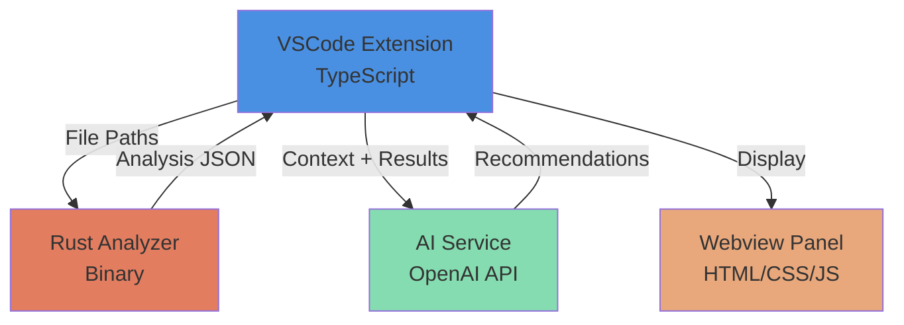
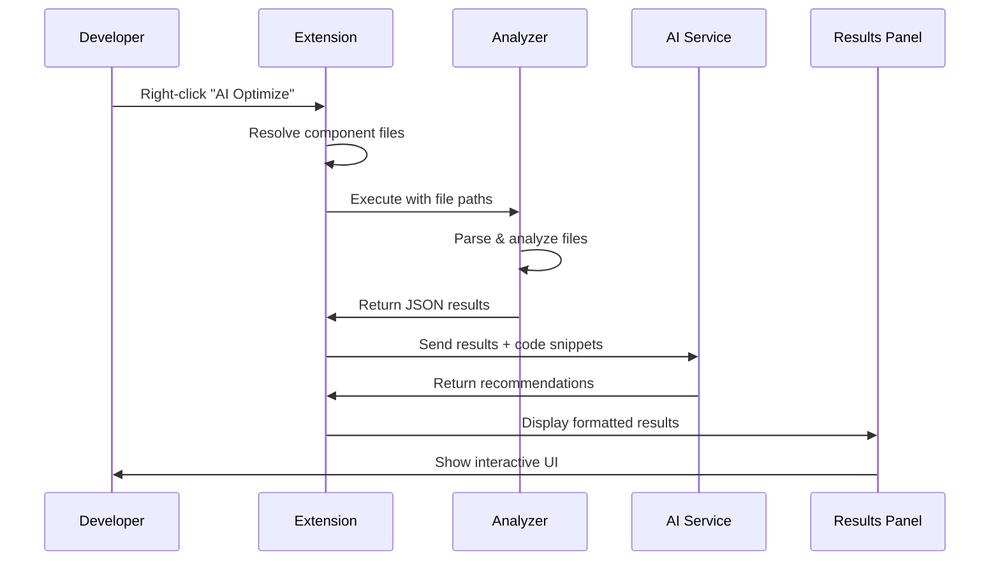
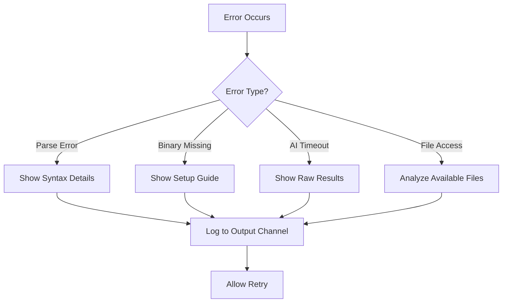

# Design Document

## Overview

The AI Frontend Optimizer is a VSCode extension that combines TypeScript-based UI orchestration with a high-performance Rust analyzer engine and AI-powered recommendations. The system follows a three-tier architecture: Extension (UI/Orchestration), Analyzer (Static Analysis), and AI Service (Intelligent Recommendations).

The design prioritizes speed, developer experience, and extensibility while maintaining a clean separation of concerns between the presentation layer, analysis engine, and AI integration.

## Architecture

### High-Level Architecture



### Component Interaction Flow



## Components and Interfaces

### 1. VSCode Extension (TypeScript)

**Responsibilities:**
- Register context menu commands
- Manage file system operations
- Orchestrate Analyzer execution
- Handle AI Service communication
- Render results in webview panel

**Key Modules:**

#### extension.ts
Entry point that registers commands and activates the extension.

```typescript
interface ExtensionContext {
  subscriptions: Disposable[];
  extensionPath: string;
}

function activate(context: ExtensionContext): void;
function deactivate(): void;
```

#### commands/optimizeCommand.ts
Handles the "AI Optimize this file" command and new scanning commands.

```typescript
interface OptimizeCommandOptions {
  filePath: string;
  showProgress: boolean;
  baseStyleFiles?: string[];
  componentMappingYaml?: string;
  scanMode?: 'single' | 'folder' | 'selection';
}

async function executeOptimize(options: OptimizeCommandOptions): Promise<void>;
async function executeOptimizeFolder(folderPath: string): Promise<void>;
async function executeOptimizeSelection(selectedFiles: string[]): Promise<void>;
```

#### rust-runner.ts
Manages communication with the Rust analyzer binary.

```typescript
interface AnalyzerResult {
  cssIssues: CssIssue[];
  tsIssues: TypeScriptIssue[];
  templateIssues: TemplateIssue[];
  similarityResults?: SimilarityResult[];
  componentSuggestions?: ComponentSuggestion[];
  baseStyleComparison?: BaseStyleComparison;
  metadata: AnalysisMetadata;
}

interface SimilarityResult {
  localClass: string;
  bestMatch: {
    baseClass: string;
    baseFile: string;
    similarityPercent: number;
  };
  matchingProperties: string[];
  differingProperties: Array<{property: string, localValue: string, baseValue: string}>;
  redundantProperties: string[];
}

interface ComponentSuggestion {
  nativeElement: string;
  line: number;
  suggestedComponent: string;
  reason: string;
}

interface BaseStyleComparison {
  duplicates: Array<{className: string, files: string[]}>;
  similarClasses: Array<{
    class1: {name: string, file: string},
    class2: {name: string, file: string},
    similarityPercent: number
  }>;
}

class RustAnalyzerRunner {
  constructor(binaryPath: string);
  async analyze(componentFiles: ComponentFiles, options?: AnalysisOptions): Promise<AnalyzerResult>;
  async analyzeSimilarity(cssFile: string, baseStyleFiles: string[]): Promise<SimilarityResult[]>;
  async analyzeWithComponentMapping(htmlFile: string, yamlConfigPath: string): Promise<ComponentSuggestion[]>;
  async compareBaseStyles(baseStyleFiles: string[]): Promise<BaseStyleComparison>;
  async checkBinaryExists(): Promise<boolean>;
}
```

#### services/aiService.ts
Integrates with AI API for recommendations.

```typescript
interface AIRecommendation {
  category: 'css' | 'typescript' | 'template';
  issueId: string;
  summary: string;
  recommendation: string;
  priority: 'high' | 'medium' | 'low';
  codeExample?: string;
}

class AIService {
  constructor(apiKey: string, model: string);
  async generateRecommendations(
    analysisResult: AnalyzerResult,
    codeSnippets: Map<string, string>
  ): Promise<AIRecommendation[]>;
}
```

#### panels/resultsPanel.ts
Manages the webview panel for displaying results.

```typescript
class ResultsPanel {
  static createOrShow(extensionUri: Uri): ResultsPanel;
  updateResults(recommendations: AIRecommendation[]): void;
  dispose(): void;
}
```

### 2. Rust Analyzer

**Responsibilities:**
- Parse Angular component files
- Perform static code analysis
- Detect unused code and complexity issues
- Return structured JSON results

**Key Modules:**

#### main.rs
CLI entry point that coordinates analysis.

```rust
struct AnalyzerArgs {
    ts_file: PathBuf,
    html_file: Option<PathBuf>,
    css_file: Option<PathBuf>,
}

struct AnalysisOutput {
    css_issues: Vec<CssIssue>,
    ts_issues: Vec<TypeScriptIssue>,
    template_issues: Vec<TemplateIssue>,
    metadata: AnalysisMetadata,
}

fn main() -> Result<(), Box<dyn Error>>;
```

#### css.rs
CSS analysis module using lightningcss or cssparser.

```rust
pub struct CssAnalyzer {
    stylesheet: Stylesheet,
    file_path: PathBuf,
}

pub struct CssIssue {
    pub issue_type: CssIssueType,
    pub selector: String,
    pub line: usize,
    pub column: usize,
    pub description: String,
}

pub enum CssIssueType {
    UnusedSelector,
    DuplicateRule,
    RedundantSelector,
}

pub struct CssClass {
    pub name: String,
    pub properties: HashMap<String, String>,
    pub line: usize,
    pub file: PathBuf,
}

pub struct SimilarityResult {
    pub local_class: String,
    pub best_match: BestMatch,
    pub matching_properties: Vec<String>,
    pub differing_properties: Vec<PropertyDiff>,
    pub redundant_properties: Vec<String>,
}

pub struct BestMatch {
    pub base_class: String,
    pub base_file: String,
    pub similarity_percent: f32,
}

pub struct PropertyDiff {
    pub property: String,
    pub local_value: String,
    pub base_value: String,
}

impl CssAnalyzer {
    pub fn new(css_content: &str, file_path: PathBuf) -> Result<Self, ParseError>;
    pub fn find_unused_selectors(&self, html_classes: &HashSet<String>) -> Vec<CssIssue>;
    pub fn find_duplicate_rules(&self) -> Vec<CssIssue>;
    pub fn extract_classes(&self) -> Vec<CssClass>;
    pub fn compare_with_base_styles(&self, base_classes: &[CssClass]) -> Vec<SimilarityResult>;
    pub fn calculate_similarity(local: &CssClass, base: &CssClass) -> f32;
}

pub fn compare_multiple_base_files(base_files: &[PathBuf]) -> Result<BaseStyleComparison, Error>;
```

#### ts.rs
TypeScript analysis using swc_ecma_parser.

```rust
pub struct TypeScriptAnalyzer {
    module: Module,
    source_map: Rc<SourceMap>,
}

pub struct TypeScriptIssue {
    pub issue_type: TsIssueType,
    pub line: usize,
    pub column: usize,
    pub identifier: String,
    pub description: String,
}

pub enum TsIssueType {
    UnusedImport,
    MissingAwait,
    DuplicateLogic,
}

impl TypeScriptAnalyzer {
    pub fn new(ts_content: &str) -> Result<Self, ParseError>;
    pub fn find_unused_imports(&self) -> Vec<TypeScriptIssue>;
    pub fn find_missing_awaits(&self) -> Vec<TypeScriptIssue>;
    pub fn detect_duplicate_logic(&self) -> Vec<TypeScriptIssue>;
}
```

#### yaml_config.rs
YAML configuration parser for component mapping.

```rust
use serde::{Deserialize, Serialize};

#[derive(Debug, Deserialize, Serialize)]
pub struct ComponentMapping {
    pub components: HashMap<String, ComponentDefinition>,
}

#[derive(Debug, Deserialize, Serialize)]
pub struct ComponentDefinition {
    pub selector: String,
    pub keywords: Vec<String>,
    pub description: Option<String>,
}

impl ComponentMapping {
    pub fn from_file(path: &Path) -> Result<Self, Error>;
    pub fn find_matching_component(&self, element_tag: &str) -> Option<&ComponentDefinition>;
}
```

#### html.rs
HTML template analysis using html5ever or scraper.

```rust
pub struct HtmlAnalyzer {
    document: Html,
}

pub struct TemplateIssue {
    pub issue_type: TemplateIssueType,
    pub line: usize,
    pub description: String,
    pub severity: Severity,
}

pub enum TemplateIssueType {
    DeepNesting,
    HeavyPipe,
    RedundantWrapper,
}

pub enum Severity {
    High,
    Medium,
    Low,
}

pub struct NativeElement {
    pub tag_name: String,
    pub line: usize,
    pub attributes: HashMap<String, String>,
}

pub struct ComponentSuggestion {
    pub native_element: String,
    pub line: usize,
    pub suggested_component: String,
    pub reason: String,
}

impl HtmlAnalyzer {
    pub fn new(html_content: &str) -> Result<Self, ParseError>;
    pub fn extract_classes(&self) -> HashSet<String>;
    pub fn find_deep_nesting(&self, max_depth: usize) -> Vec<TemplateIssue>;
    pub fn find_heavy_pipes(&self) -> Vec<TemplateIssue>;
    pub fn find_redundant_wrappers(&self) -> Vec<TemplateIssue>;
    pub fn extract_native_elements(&self) -> Vec<NativeElement>;
    pub fn suggest_components(&self, component_mapping: &ComponentMapping) -> Vec<ComponentSuggestion>;
}
```

### 3. AI Service Integration

**Design Pattern:** Adapter pattern to support multiple AI providers

```typescript
interface AIProvider {
  generateRecommendations(
    prompt: string,
    context: AnalysisContext
  ): Promise<string>;
}

class OpenAIProvider implements AIProvider {
  // OpenAI-specific implementation
}

class InternalModelProvider implements AIProvider {
  // Internal model implementation
}
```

### 4. Webview Panel UI

**Technology:** HTML + CSS + Vanilla JavaScript (bundled with extension)

**Layout Structure:**
- Header: Component name and analysis timestamp
- Tabs: CSS Issues | TypeScript Issues | Template Complexity
- Issue Cards: Each issue displayed with severity badge, description, location, and recommendation
- Action Buttons: "Go to Code", "Dismiss", "Apply Fix" (future)

## Data Models

### Analysis Result Schema

```json
{
  "metadata": {
    "componentName": "user-profile.component",
    "analyzedAt": "2025-11-15T10:30:00Z",
    "analysisTimeMs": 1250,
    "filesAnalyzed": {
      "typescript": "user-profile.component.ts",
      "html": "user-profile.component.html",
      "css": "user-profile.component.css"
    }
  },
  "cssIssues": [
    {
      "issueType": "UnusedSelector",
      "selector": ".unused-class",
      "line": 45,
      "column": 1,
      "description": "CSS selector not found in template"
    }
  ],
  "tsIssues": [
    {
      "issueType": "UnusedImport",
      "line": 3,
      "column": 10,
      "identifier": "Observable",
      "description": "Import declared but never used"
    }
  ],
  "templateIssues": [
    {
      "issueType": "DeepNesting",
      "line": 78,
      "description": "Loop nesting exceeds 2 levels",
      "severity": "High"
    }
  ]
}
```

### AI Recommendation Schema

```json
{
  "recommendations": [
    {
      "category": "css",
      "issueId": "css-unused-0",
      "summary": "Remove unused CSS selector",
      "recommendation": "The class '.unused-class' is defined but never used in the template. Removing it will reduce bundle size by approximately 50 bytes.",
      "priority": "medium",
      "codeExample": "// Remove lines 45-48 from user-profile.component.css"
    }
  ]
}
```

### CSS Similarity Result Schema

```json
{
  "similarityResults": [
    {
      "localClass": ".local-button",
      "bestMatch": {
        "baseClass": ".go5-button-primary",
        "baseFile": "design-system/buttons.scss",
        "similarityPercent": 92
      },
      "matchingProperties": [
        "padding: 12px 24px",
        "border-radius: 4px",
        "font-weight: 600",
        "line-height: 1.5"
      ],
      "differingProperties": [
        {
          "property": "background-color",
          "localValue": "#eee",
          "baseValue": "var(--go5-primary)"
        }
      ],
      "redundantProperties": ["margin-top"]
    }
  ]
}
```

### Component Suggestion Schema

```json
{
  "componentSuggestions": [
    {
      "nativeElement": "button",
      "line": 45,
      "suggestedComponent": "go5-button",
      "reason": "Found native <button> but design system has go5-button component"
    },
    {
      "nativeElement": "input",
      "line": 67,
      "suggestedComponent": "go5-input",
      "reason": "Found native <input> but design system has go5-input component"
    }
  ]
}
```

### Base Style Comparison Schema

```json
{
  "baseStyleComparison": {
    "duplicates": [
      {
        "className": ".btn-primary",
        "files": ["global.scss", "components/button.scss"]
      }
    ],
    "similarClasses": [
      {
        "class1": {
          "name": ".card-container",
          "file": "global.scss"
        },
        "class2": {
          "name": ".panel-wrapper",
          "file": "theme.scss"
        },
        "similarityPercent": 85
      }
    ]
  }
}
```

### Component Mapping YAML Schema

```yaml
components:
  go5-button:
    selector: go5-button
    keywords: ["button", "btn", "action"]
    description: "Primary button component from GoFive design system"
  
  go5-input:
    selector: go5-input
    keywords: ["input", "textbox", "field"]
    description: "Input field component from GoFive design system"
  
  go5-card:
    selector: go5-card
    keywords: ["card", "panel", "container"]
    description: "Card container component from GoFive design system"
```

## Error Handling

### Error Categories and Strategies

1. **File System Errors**
   - Strategy: Graceful degradation - analyze available files only
   - User Feedback: Warning message indicating which files couldn't be read

2. **Parsing Errors**
   - Strategy: Report specific syntax errors with line numbers
   - User Feedback: Error panel with parsing details and suggestions

3. **Analyzer Binary Errors**
   - Strategy: Check binary existence on activation, provide installation guide
   - User Feedback: Setup wizard for first-time users

4. **AI Service Errors**
   - Strategy: Retry with exponential backoff (max 3 attempts)
   - User Feedback: Show raw analysis results if AI unavailable
   - Fallback: Display analysis without AI recommendations

5. **Timeout Errors**
   - Strategy: 30-second timeout for Rust analyzer, 15-second timeout for AI
   - User Feedback: Progress cancellation option with partial results

### Error Handling Flow



## Testing Strategy

### Unit Testing

**Extension (TypeScript):**
- Framework: Jest + @vscode/test-electron
- Coverage: Command handlers, file resolution, data transformation
- Mocking: VSCode API, file system, child process execution

**Analyzer (Rust):**
- Framework: Built-in Rust testing + cargo-tarpaulin for coverage
- Coverage: Each analyzer module (css.rs, ts.rs, html.rs)
- Test Data: Sample Angular components with known issues

### Integration Testing

**Extension ↔ Analyzer:**
- Test: End-to-end command execution with real Rust binary
- Validation: JSON schema compliance, error handling

**Extension ↔ AI Service:**
- Test: Mock AI responses, timeout handling, retry logic
- Validation: Recommendation format, error recovery

### Performance Testing

**Benchmarks:**
- Small component (< 200 lines): < 1 second
- Medium component (200-500 lines): < 2 seconds
- Large component (500-1000 lines): < 3 seconds

**Tools:**
- Rust: criterion for micro-benchmarks
- Extension: VSCode performance profiler

### Manual Testing Checklist

- [ ] Context menu appears on Angular component files
- [ ] Analysis completes and panel displays results
- [ ] Clicking issue navigates to correct line in code
- [ ] Error messages are clear and actionable
- [ ] Progress indicator shows during analysis
- [ ] Extension works on Windows, macOS, and Linux

## Deployment and Distribution

### Extension Packaging

- Bundle Rust binary for each platform (Windows, macOS, Linux)
- Use webpack to bundle TypeScript code
- Include platform-specific binaries in extension package
- VSCode extension manifest (package.json) configuration

### Binary Distribution Strategy

```
extension/
├── bin/
│   ├── analyzer-win.exe
│   ├── analyzer-macos
│   └── analyzer-linux
└── out/
    └── extension.js
```

Runtime binary selection based on `process.platform`.

### Installation Flow

1. User installs extension from VSCode marketplace
2. Extension activates and checks for appropriate binary
3. If binary missing or corrupted, show setup instructions
4. User configures AI API key in settings (if required)
5. Extension ready to use

## Configuration

### VSCode Settings

```json
{
  "aiFrontendOptimizer.aiProvider": "openai",
  "aiFrontendOptimizer.apiKey": "",
  "aiFrontendOptimizer.model": "gpt-4",
  "aiFrontendOptimizer.maxNestingDepth": 2,
  "aiFrontendOptimizer.enableAutoAnalysis": false,
  "aiFrontendOptimizer.analyzerTimeout": 30,
  "aiFrontendOptimizer.baseStyleFiles": [],
  "aiFrontendOptimizer.componentMappingYaml": "",
  "aiFrontendOptimizer.similarityThreshold": 80,
  "aiFrontendOptimizer.enableSimilarityScanning": true,
  "aiFrontendOptimizer.enableComponentSuggestions": true
}
```

## Security Considerations

1. **API Key Storage**: Use VSCode's SecretStorage API for sensitive credentials
2. **Code Transmission**: Only send necessary code snippets to AI, not entire files
3. **Binary Verification**: Include checksums for Rust binaries
4. **Sandboxing**: Rust analyzer runs as separate process with no network access
5. **Data Privacy**: Option to disable AI features and use local analysis only

## New Features Architecture

### CSS Similarity Detection

**Algorithm:** Cosine Similarity or Jaccard Index

The similarity calculation compares CSS properties between local and base classes:

```rust
fn calculate_similarity(local: &CssClass, base: &CssClass) -> f32 {
    let local_props: HashSet<_> = local.properties.keys().collect();
    let base_props: HashSet<_> = base.properties.keys().collect();
    
    let intersection = local_props.intersection(&base_props).count();
    let union = local_props.union(&base_props).count();
    
    // Jaccard similarity
    (intersection as f32) / (union as f32) * 100.0
}
```

**Workflow:**
1. User selects base style files via file picker
2. Analyzer extracts all classes from base files
3. Analyzer compares component CSS against base classes
4. Results show similarity percentage and property differences
5. AI generates replacement suggestions

### Component Mapping System

**YAML-based Configuration:**

Users provide a YAML file defining design system components and their keywords. The analyzer matches native HTML elements against these keywords.

**Matching Logic:**
```rust
fn find_matching_component(element: &str, mapping: &ComponentMapping) -> Option<String> {
    for (component_name, definition) in &mapping.components {
        if definition.keywords.contains(&element.to_lowercase()) {
            return Some(component_name.clone());
        }
    }
    None
}
```

### Multi-file Base Style Comparison

**Purpose:** Identify redundancy within the design system itself

**Process:**
1. Load multiple base style files
2. Extract all classes from each file
3. Compare classes across files
4. Report duplicates (same name, different files)
5. Report similar classes (different names, similar properties)

### Selective Scanning

**UI Integration:**
- Context menu on files: "AI Optimize this file"
- Context menu on folders: "AI Optimize this folder"
- Command palette: "AI Frontend Optimizer: Scan Selection"

**Folder Scanning:**
1. Recursively find all `.component.ts` files
2. Show quick pick with checkboxes
3. Analyze selected components in batch
4. Show aggregated results

## Future Extensibility

### Planned Enhancements (Post-MVP)

1. **Auto-fix Capability**: Apply recommended changes automatically
2. **Custom Rules**: Allow teams to define custom analysis rules
3. **React/Vue Support**: Extend beyond Angular
4. **Performance Metrics**: Track bundle size reduction over time
5. **CI/CD Integration**: Command-line interface for automated checks
6. **Design System Validation**: Ensure all components follow design system guidelines
